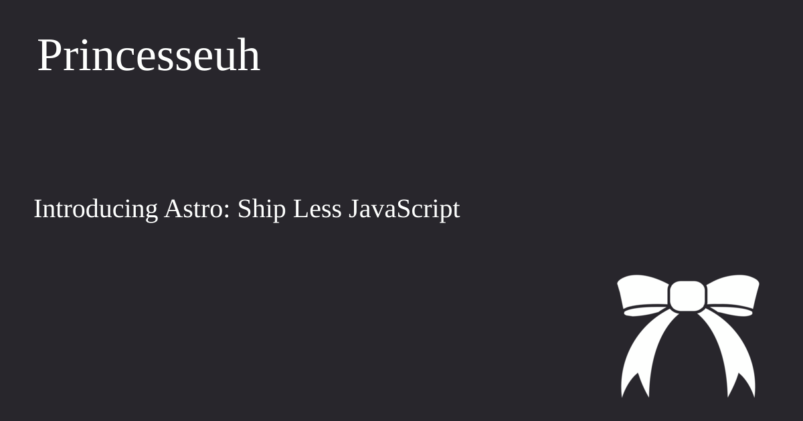

# astro-social-images

⚠️ Very early in development, it works but that's about it ⚠️

Add a component to generate Opengraph images to [Astro](https://astro.build/), inspired by [eleventy-plugin-social-images](https://github.com/manustays/eleventy-plugin-generate-social-images).

Unlike other solutions for Astro, it uses a .svg file that is then converted to png through `sharp`. This mean no headless browser, no third-party service etc.

It's all local which can be good or bad, check out different options and see which one fits your needs best!

## Usage

```astro
---
import { SocialImage } from "astro-social-images"
---

<SocialImage
  backgroundColor="#28262c"
  texts={[{ content: "My super title", attributes: { x: "55", y: "105", "font-size": "70px", fill: "#fefffe" } }]} />
```

will generate the following image:


You can add as many texts as you want and also images, see [API](#api) for more ways to customize your images

```astro
---
import { SocialImage } from "astro-social-images"
---

<SocialImage
  backgroundColor="#28262c"
  images={[{ url: "public/resized-social-card.png", attributes: { top: 375, left: 900 } }]}
  texts={[{ content: "Princesseuh", attributes: { x: "55", y: "105", "font-size": "70px", fill: "#fefffe" } }, { content: "Introducing Astro: Ship Less JavaScript", attributes: { x: "50", y: "325", "font-size": "40px", fill: "#fefffe" } }]} />
```



## [Complete Docs available here](./Docs.md)

## FAQ

### How to use custom fonts

Sharp doesn't load external fonts, the best way to get this working at the moment is by following the custom fonts instructions in the [eleventy-plugin-generate-social-images README](https://github.com/manustays/eleventy-plugin-generate-social-images#custom-fonts)
